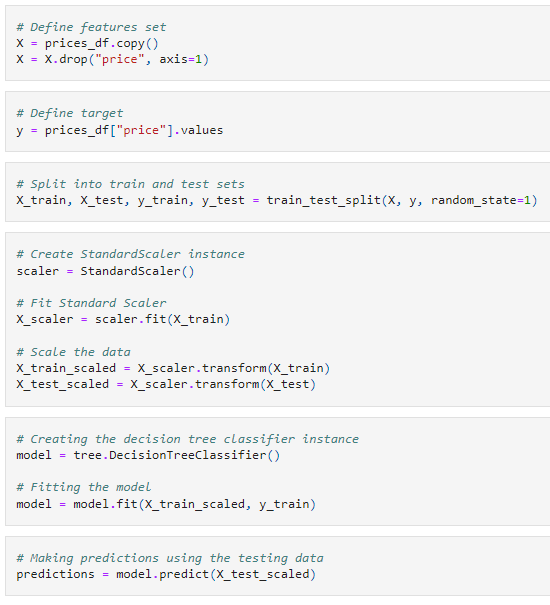

# Analysis of Real Estate Prices in Mexico

**Bootcamp Final Project**

## Overview

### Topic

Given the importance and growth that the real estate has shown in Mexico in the last few years, we´ll analyze and measure the prices of housing and commercial properties considering important features like location, ground and construction surface, age, number of rooms, bathrooms, and parking, etc., by creating a model that will predict the downs and rises of the real estate prices.

### Justification

After analyzing several options, we decided to select this topic for the following reasons:

`1` To develop the analysis we’ll use almost all topics covered in the Bootcamp Course, from web scraping, ETL, working with Pandas, SQL, reading CSV, visualization, and machine learning.

`2` Also, we think it could be useful for people looking into buying a new home or simply for those seeking to maximize investing in real estate in Mexico. 

`3` Finally, this analysis could expand in determining price changes over time by scrapping information periodically, and from many other sources.

### Source of data

In this first stage of the project, we’ll download the data from `metroscubicos.com`, the third most visited webpage in Mexico which is associated with `Mercadolibre.com`, according to the marketing agency “Impactum”

### Questions to answer

Considering the features before mentioned, the model will answer the following questions: 

**1.** Where are the places in Mexico with the highest and lowest prices per square meter by asset type (house, apartment, land)?

**2.** According to the predicted prices, where are the best opportunities for undervalued assets?

### Project steps

To achieve our goal, we’ll develop and code at least the next steps.

`1.` **Webscraping**. Create a python code with beautiful soup and splinter to retrieve asset data from several webpages, such as metroscubicos.com, and create a raw data CSV.

`2.` **ETL**. Raw data needs to be cleaned, transformed, and add new information from other sources to generate a final SQL database.

`3.` **ML model**. We will use a supervised linear regression machine learning model that helps us determine the price target variable based on features such as location, type, land size, construction square meters, number of rooms, number of bathrooms, etc.

`4.` **Dashboard**. We will create visualizations and interactions to display our results in Tableau.

## Team Members and roles

|Avatar                         |Member        |Role: Segment 1| Icon                               |
|:-----------------------------:|:------------:|:-------------:|:----------------------------------:|
|Brenda Treviño|ML model       ||
    |Luis Carmona  |Technology     |              |
|Carlos Acosta |Database       |    |
  |Jorge Castro  |Repository     |    |

## Resources and Technology

We’ll perform the steps mentioned before using the following programs and sources:

- Data source: we’ll get raw data scraped from real estate websites to store it as CSV.

 

- ETL Process: we’ll use Pandas to read, transform and clean CSV to data frames, as well as to merge additional data, and store it in an SQL database.

 

- ML model: we'll use scikit libraries to create a linear regression model and test other models to get the best accuracy for real estate pricing prediction.

 

- Dashboard: we’ll use Tableau to import our data and try to use geographical coordinates to show our analyses by entities.

 

- Software: to perform the analysis, additionally we’ll use Jupyter Notebook v6.4.5, SQLite, and Tensorflow 2.0.

    

## Github

### Communication Protocols

To communicate among the team members, we decided to create a group on Whatsapp. The reason why we are not using Slack is that team members have different activities and schedules so checking Slack throughout the day is not as common as checking our smartphones for general messages. `It seems to be working.`

Also, we decided to establish zoom meetings, outside those for classes, if there is something we need to review among us.

### Branches

In this first stage, according to our roles, we created the main branch, and the individual branches as follows:

**A.** Jorge created the Github repository, added the `Branch_Testing` to verify the functionality of the branches, and added the `add-license-1` to protect the project with the MIT license.

**B.** Brenda created the `ML_Model` branch in which she added the model muck up of linear regression.

**C.** Carlos created the `Data` branch and he added the code to scrape the information from the source, and the code to extract, transform and load the data.

**D.** Luis created the `Readme` branch and contributed to improving the presentation of the project, by adding some images and adequate content.

## Database

The following image shows the two main tables in our database:

Besides the data from the webscraping, we will obtain information regarding the location (lat, long) for each ***municipality*** so that we can plot them on a map and make an analysis by zip codes.

Our mockup database is /Resources/mockData.csv and contains what we think we might get from the webscrapping process. The following image shows the structure of the CSV loaded into a Pandas DataFrame:

## Machine Learning model

For this project our model will be done with supervised learning, using examples and labels to find patterns in our data. We will be using a linear regression model under the assumption that the relationship between the price (dependent continuous variable) and the other more explanatory house features is linear. 

It is also worth mentioning that this is a regression model because we want to predict a numerical outcome (price). Because of this, our first approach is the Random Forest classifier, to learn from data and aggregate their resulting predictions.

The following image shows our first attempt to model our data after all the necessary imports:

We are aware that this is our first approach and that we will have to go through several iterations and even alterations to get our model up to a high standard.
