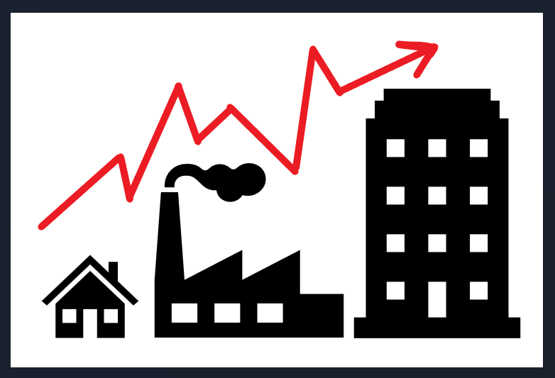
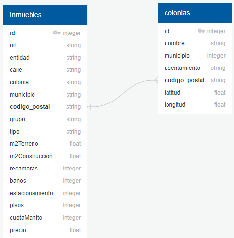
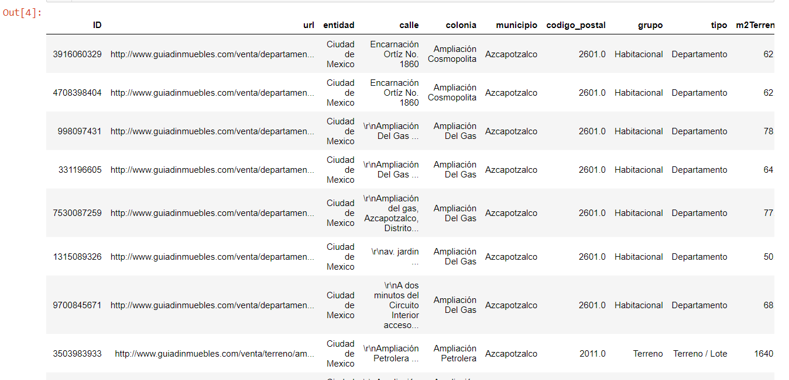
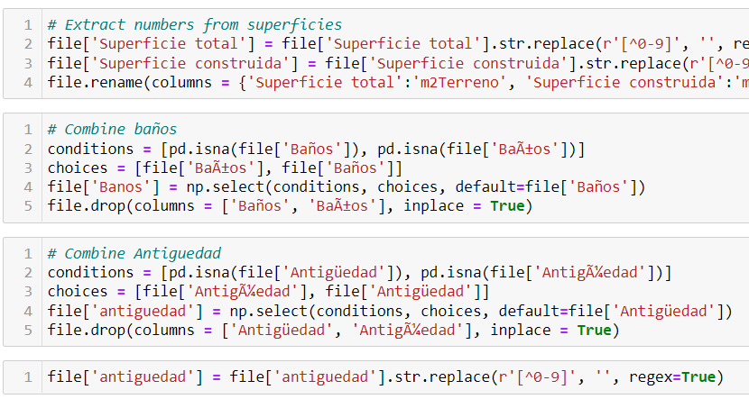
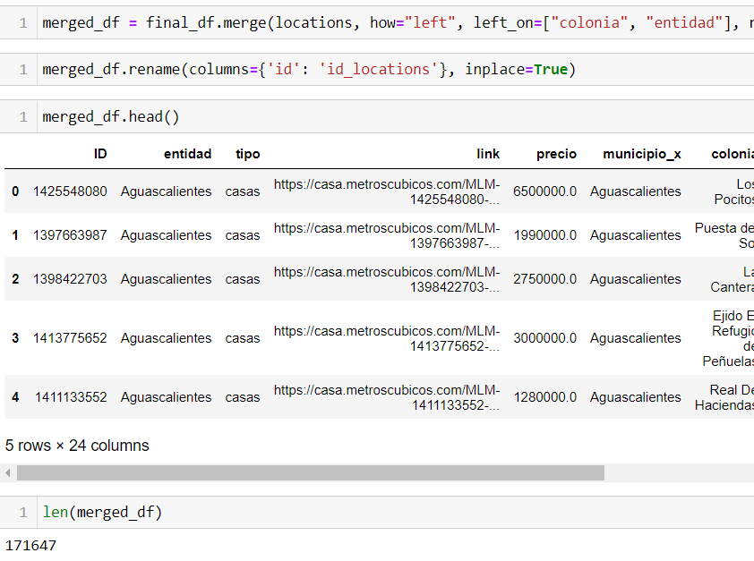
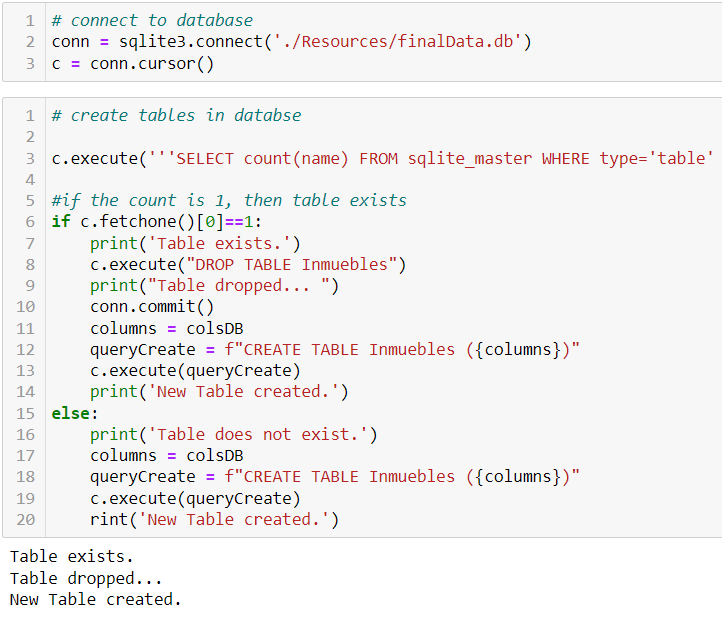
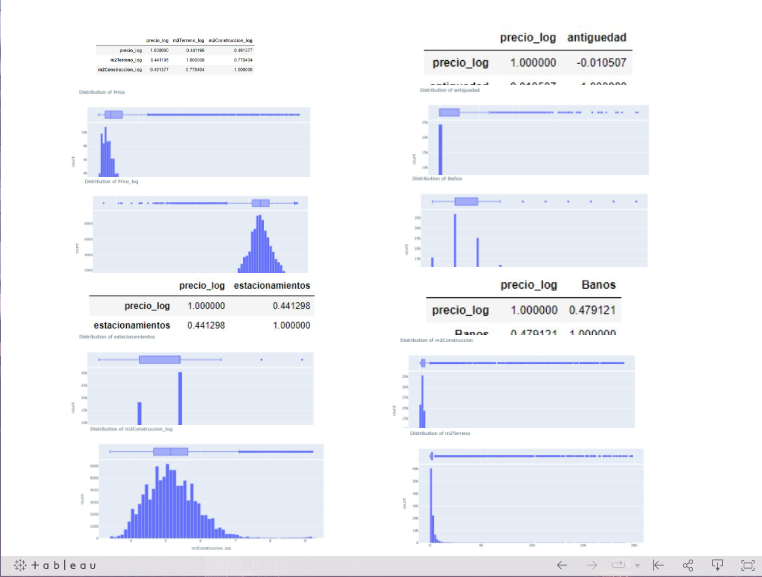
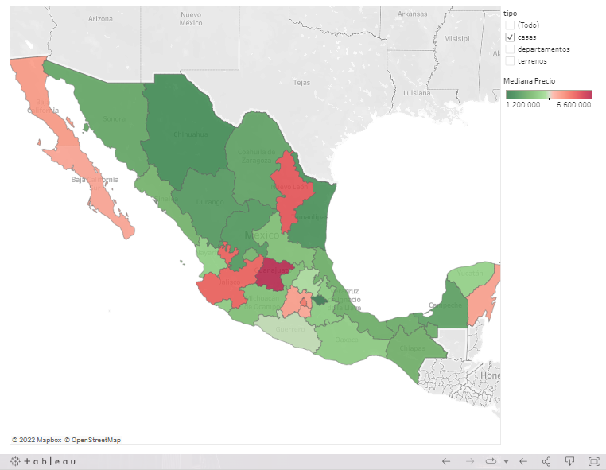

# Analysis of Real Estate Prices in Mexico

- HOUSING PRICES IN MEXICO

# Team Members

- HOUSING PRICES IN MEXICO

You can watch the following presentation: [PROPERTIES PRICE ESTIMATION](https://docs.google.com/presentation/d/17rQp70f1DyF2N-gzHGjLKhIUiLSXYhmO-v3CHtlMWuU/edit?usp=sharing)

You can watch the Storyboard on Google Slide: [PROPERTIES PRICE ESTIMATION](https://docs.google.com/presentation/d/1oBZPOv5VrmcHvKBZTlqlLSLCKziRQfEUWi8U0p8uQz8/edit?usp=sharing)

You can watch the Storyboard on Tableau: [PROPERTIES PRICE ESTIMATION](https://public.tableau.com/app/profile/jorge.castro2269/viz/AnalysisofRealEstatePricesinMexico/AnalysisofRealEstatePricesinMexico)

Heroku deployment Here!: [PROPERTIES PRICE ESTIMATION](https://tacc-bootcamp.herokuapp.com/)

# HOUSING PRICES IN MEXICO

## Overview

### Topic

Given the importance and growth that the real estate has shown in Mexico in the last few years, we have analyzed and measured the prices of housing and commercial properties considering important features like location, ground and construction surface, age, number of rooms, bathrooms, and parking, etc., by creating a model that can predict the ups and downs of real estate prices.

### Justification

After analyzing several options, we decided to select this topic for the following reasons:

`1` To develop the analysis we used almost all topics covered in the Bootcamp Course, from web scraping, ETL, working with Pandas, SQL, reading CSV, visualization, and machine learning.

`2` Also, we think it could be useful for people looking into buying a new home or simply for those seeking to maximize investing in real estate in Mexico. 

`3` Finally, this analysis could expand in determining price changes over time by scrapping information periodically, and from many other sources.

### Source of data

In this stage of the project, we downloaded the data from `metroscubicos.com`, the third most visited webpage in Mexico which is associated with `Mercadolibre.com`, according to the marketing agency “Impactum”

### Questions to answer

Considering the features before mentioned, the model can answer the following questions: 

**1.** Where is the best place to buy a property in Mexico?

**2.** Which cities have the higher and lower property prices in Mexico?

**3.** Considering the features what could be the price of a new property?

### Project steps

To achieve our goal, we developed and coded the next steps.

`1.` **Web scraping**. Create a python code with beautiful soup and splinter to retrieve asset data from metroscubicos.com, and created a raw data CSV.

`2.` **ETL**. Raw data were cleaned, transformed, and added with new information from other sources to generate a final SQL database.

`3.` **SQLite**. After the raw data has been cleaned and transformed we stored the new data in an SQL table "SQLite".

`4.` **ML model**. We used a supervised linear regression machine learning model to determine the price target variable based on features such as location, type, land size, construction square meters, number of rooms, number of bathrooms, etc.

`5.` **Dashboard**. We created visualizations and interactions to display our results in Tableau.

`6.` **App**. Finally, we created a webpage where the user can interact with the app: https://tacc-bootcamp.herokuapp.com/

## Team Members and roles

|Avatar                         |Member        |Role: Segment 1| Icon                               |
|:-----------------------------:|:------------:|:-------------:|:----------------------------------:|
|Brenda Treviño|ML model       ||
    |Luis Carmona  |Technology     |              |
|Carlos Acosta |Database       |    |
  |Jorge Castro  |Repository     |    |

## Resources and Technology

We performed the steps mentioned before using the following programs and sources:

- Data source: raw data was scraped from metroscubicos.com and stored as CSV.

 

- ETL Process: we used Pandas to read, transform and clean the CSV to data frames, as well as to merge additional data, and store it in an SQL database.

 

- SQLite Process: we’ll use SQLite to store cleaned and transformed data, and to collect the data for the Model process.
 
 

- ML model: we used scikit libraries to create a linear regression model and test other models to get the best accuracy for real estate pricing prediction.

 

- Dashboard: we used Tableau to import our data and try to use geographical coordinates to show our analyses by entities.

 

- Webpage: we used flask to create an app, HTML to make the template, javascript and CSS for the functions and style of the page, and Heroku to deploy it.

    

- Software: to perform the analysis, additionally we used Jupyter Notebook v6.4.5, SQLite, and Tensorflow 2.0.

    

## Database Process

The following image shows the two main tables in our database:

Besides the data from the web scraping, we obtained information regarding the location (lat, long) for each ***municipality*** so that we can plot them on a map and make an analysis by zip codes.

Our mockup database was /Resources/mockData.csv and contains the web scrapping process. The following image shows the structure of the CSV loaded into a Pandas DataFrame:

## Data Retreival Process

`1.` We scraped links of prices house from a web page metroscubicos.com 

`2.` We were able to obtain a ton of links with detailed information on house prices per each State in Mexico.

`3.` All this information was either combined or concentrated into 32 CSV files.

`4.` We extracted the data from the 32 files and concentrated the information into a single file.

`5.` With the single file ready we performed the ETL process. The data was messy and needed to be cleaned deeply.

`6.` After our data was cleaned we merged the data into a single file. 

`7.` After we add the final file containing all the information we created a table using SQLite to store the results.

`8.` After we had the database ready we started our Machine Learning Model.

## Machine Learning Model

#### Data preprocessing

The data was taken through a web scraping process from a real estate website. This meant that the information was accurate and updated but we dealt with other issues like the number of features added for each estate. Once we had the data, we took the following steps:

`1.` Assess the quality of the data. We verified that the data was reliable and that the information was accurate. At a first glance, it was possible to see that we were working with different data types, that some outliers might skew our analysis and we saw that some missing data needed to be managed.	

`2.` Clean the data. 

 a. All unnecessary columns were eliminated, and IDs, links, and other internal identification codes were not relevant for the machine learning model. 
 
 b.	Unified the format some data was shown on the website like dates, square meters, and prices.
 
 c.	Identified outliers and manage them accordingly, sometimes through binning and sometimes getting rid of them
 
 d.	Evaluate missing data, some could be filled with information from other columns, and in other cases, we fill in missing data. 
 
`3.`	Transform the data. To prepare the data for the analysis, we had to transform some variables to their logarithmic expression. OneHotEncoder was used to factor in each of the states.

`4.`	Reduce the data. We planned on building three different models, one for each type of property analyzed (houses, apartments, and land) so we kept only the relevant columns for each one. 

#### Feature engineering and feature selection

*Feature Engineering*
- As it was mentioned before, the dataset had a significant number of missing values. For features like parking spaces, all missing values were filled with 0, this numerical imputation would allow us to consider the feature without eliminating rows with missing values.
- For the handling of outliers, we opted for removal in certain features like rooms, bathrooms, or square meters. Capping was considered but an arbitrary value hurt the accuracy level of our model. 
- Even after handling outliers some features still showed some sort of skewed distribution. We used Log Transform for the features of prices and square meters (floor area and lot area).

*Feature Selection* 
- To decide which features to keep for our model, we analyzed the correlation between the different variables and the price of the property. High correlations (0.44 and 0.49) were found between lot area and floor area with a price. The number of bathrooms and the number of parking spaces also showed a significant correlation (0.47 and 0.44, respectively) with the price.
- Other features, like latitude and longitude, although useful for the visualization of our data, proved to impact negatively our model, so we decided to eliminate them from our dataset.

#### Data split into training and testing sets

We used train_test_split from the sklearn.model_selection library to split our data into training and testing sets. We used random sampling to protect the data from any bias and because we didn’t input a test size in the parameters it was set by default to 0.25, which means the train was automatically set to 0.75.

#### Model choice

For this project our model will be done with supervised learning, using examples and labels to find patterns in our data. We will be using a linear regression model under the assumption that the relationship between the price (dependent continuous variable) and the other more explanatory house features is linear. 

It is also worth mentioning that this is a regression model because we want to predict a numerical outcome (price). Because of this, our first approach is the Random Forest Regressor, to learn from data and aggregate their resulting predictions.

Limitations of the model have to do with the fact that we are using states as features and although they provide sufficient information, a division by municipalities, neighborhoods, or zip codes would probably provide higher accuracy. However, data is not easily obtained, and it might result in overfitting.

#### Changes in model

The main changes in our model have to do with the different ways to use our features. We also tested AdaBoost Regressor, Gradient Boosting Regressor, Decision Tree Regressor, and HistGradient Boosting Regressor, but we kept Random Forest Regressor because it provided the best results.

For the model of the apartment, we decided to test the same tools and kept the HistGradientBoosting Regressor since it provided the highest accuracy scores.

### Training and Improving our Machine Learning model

In the beginning, the first R Score was 25%.

`1.` **First Attempt**

We continue working to improve the model, it went better when it got to 35%.

`2.` **Second Attempt**

However we wanted more, so more attempts were made...

`3.` **Third Attempt**

We continue improving our model, and by using Random Forest Regressor we were able to obtain our best R score so far, 67%

`4.` **Fourth Attempt**

### Current Accuracy Scores

**Houses Model**

We are currently working with a 72%

**Apartments Model**

It has a 60% accuracy

**Land Model**

Working with 42.21% accuracy

## Dashboard

We used Tableau to code the dashboard. We import the data and use geographical coordinates to show our analyses by entities.

In the first image are the graphs of the initial data analysis:

The second one is the map colored by the average price of the properties by the state in Mexico. 

## Summary

### Results and limitations

**1.** The data was obtained from one webpage.

**2.** The price is predicted per state which means it does not take into consideration municipalities, neighborhoods, or zip codes which would probably provide higher accuracy.

**3.** The predicted price is calculated by taking between 5 and 8 numerical features per property, but we do not have a clear influence of these features on the price.

**4.** In some cases the difference between the real price and the predicted price is very different.

### Recommendations and Improvements

**A.** Get the information from many other sources to have a better sample of the prices.

**B.** Try to calculate the price based on many other features like municipalities, neighborhoods or zip codes, price of land per meter, price of construction per meter, etc.

**C.** We would improve the scrapping of the data to get it faster and with a certain periodicity. 

**D.** Based on the quantity of information, we would probably try with a big data program or a neuronal net.

**E.** We would search what other external features influence the property prices to consider them.
