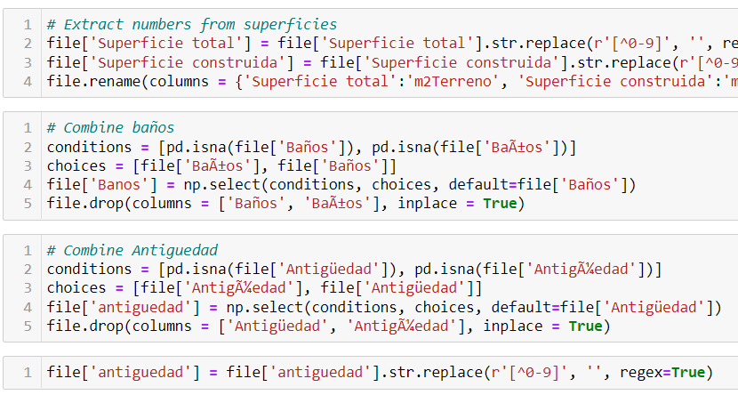
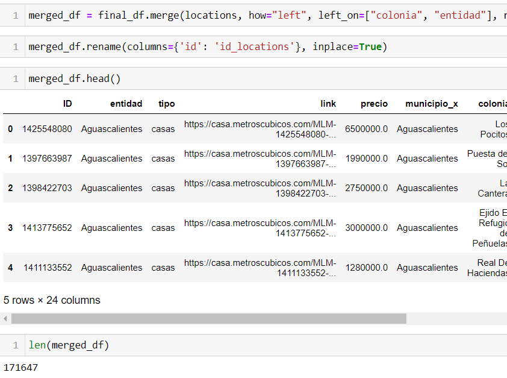
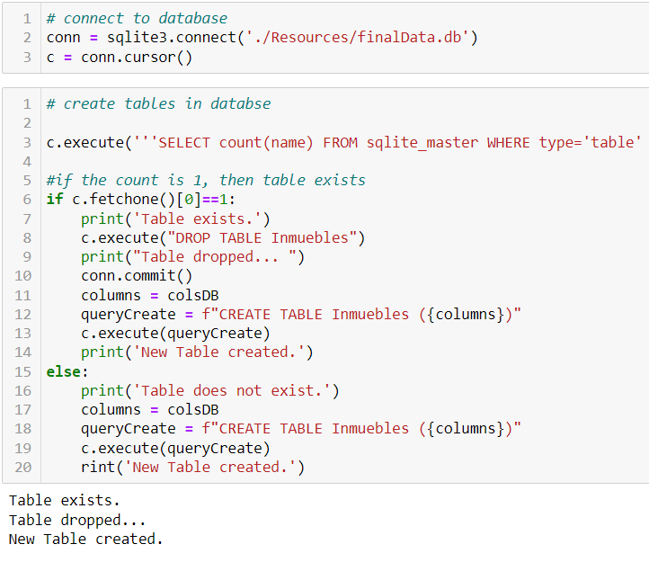

# Analysis of Real Estate Prices in Mexico

- HOUSING PRICES IN MEXICO

# Team Members

- HOUSING PRICES IN MEXICO

You can watch the following presentation: [PROPERTIES PRICE ESTIMATION](https://docs.google.com/presentation/d/17rQp70f1DyF2N-gzHGjLKhIUiLSXYhmO-v3CHtlMWuU/edit?usp=sharing)

You can watch the Storyboard on Google Slide: [PROPERTIES PRICE ESTIMATION](https://docs.google.com/presentation/d/1oBZPOv5VrmcHvKBZTlqlLSLCKziRQfEUWi8U0p8uQz8/edit?usp=sharing)

# HOUSING PRICES IN MEXICO

## Overview

### Topic

Given the importance and growth that the real estate has shown in Mexico in the last few years, we´ll analyze and measure the prices of housing and commercial properties considering important features like location, ground and construction surface, age, number of rooms, bathrooms, and parking, etc., by creating a model that will predict the downs and rises of the real estate prices.

### Justification

After analyzing several options, we decided to select this topic for the following reasons:

`1` To develop the analysis we’ll use almost all topics covered in the Bootcamp Course, from web scraping, ETL, working with Pandas, SQL, reading CSV, visualization, and machine learning.

`2` Also, we think it could be useful for people looking into buying a new home or simply for those seeking to maximize investing in real estate in Mexico. 

`3` Finally, this analysis could expand in determining price changes over time by scrapping information periodically, and from many other sources.

### Source of data

In this first stage of the project, we’ll download the data from `metroscubicos.com`, the third most visited webpage in Mexico which is associated with `Mercadolibre.com`, according to the marketing agency “Impactum”

### Questions to answer

Considering the features before mentioned, the model will answer the following questions: 

**1.** Where are the places in Mexico with the highest and lowest prices per square meter by asset type (house, apartment, land)?

**2.** According to the predicted prices, where are the best opportunities for undervalued assets?

### Project steps

To achieve our goal, we’ll develop and code at least the next steps.

`1.` **Webscraping**. Create a python code with beautiful soup and splinter to retrieve asset data from several webpages, such as metroscubicos.com, and create a raw data CSV.

`2.` **ETL**. Raw data needs to be cleaned, transformed, and add new information from other sources to generate a final SQL database.

`3.` **SQlite**. After the raw data has been cleaned and transformed we stored the new data into an SQL table "SQlite".

`4.` **ML model**. We will use a supervised linear regression machine learning model that helps us determine the price target variable based on features such as location, type, land size, construction square meters, number of rooms, number of bathrooms, etc.

`5.` **Dashboard**. We will create visualizations and interactions to display our results in Tableau.

## Team Members and roles

|Avatar                         |Member        |Role: Segment 1| Icon                               |
|:-----------------------------:|:------------:|:-------------:|:----------------------------------:|
|Brenda Treviño|ML model       ||
    |Luis Carmona  |Technology     |              |
|Carlos Acosta |Database       |    |
  |Jorge Castro  |Repository     |    |

## Resources and Technology

We’ll perform the steps mentioned before using the following programs and sources:

- Data source: we’ll get raw data scraped from real estate websites to store it as CSV.

 

- ETL Process: we’ll use Pandas to read, transform and clean CSV to data frames, as well as to merge additional data, and store it in an SQL database.

 

- SQlite Process: we’ll use SQlite to store our cleaned data thet was transform and clean, we will use SQlite to collect our data for our Model process.
 
 

- ML model: we'll use scikit libraries to create a linear regression model and test other models to get the best accuracy for real estate pricing prediction.

 

- Dashboard: we’ll use Tableau to import our data and try to use geographical coordinates to show our analyses by entities.

 

- Software: to perform the analysis, additionally we’ll use Jupyter Notebook v6.4.5, SQLite, and Tensorflow 2.0.

    

## Github

### Communication Protocols

To communicate among the team members, we decided to create a group on Whatsapp. The reason why we are not using Slack is that team members have different activities and schedules so checking Slack throughout the day is not as common as checking our smartphones for general messages. `It seems to be working.`

Also, we decided to establish zoom meetings, outside those for classes, if there is something we need to review among us.

### Branches

In this first stage, according to our roles, we created the main branch, and the individual branches as follows:

**A.** Jorge created the Github repository, added the `Branch_Testing` to verify the functionality of the branches, and added the `add-license-1` to protect the project with the MIT license.

**B.** Brenda created the `ML_Model` branch in which she added the model mock up of linear regression.

**C.** Carlos created the `Data` branch and he added the code to scrape the information from the source, and the code to extract, transform and load the data.

**D.** Luis created the `Readme` branch and contributed to improving the presentation of the project, by adding some images and adequate content.

## Database Process

The following image shows the two main tables in our database:

Besides the data from the webscraping, we will obtain information regarding the location (lat, long) for each ***municipality*** so that we can plot them on a map and make an analysis by zip codes.

Our mockup database is /Resources/mockData.csv and contains what we think we might get from the webscrapping process. The following image shows the structure of the CSV loaded into a Pandas DataFrame:

## Data Retreival Process

`1.` We scraped links of prices houese from a web page metroscubicos.com 

`2.` We were able to obtain a ton of links with detail information on house prices per each State in Mexico. T

`3.` All this information was ater combined and concentrated into 32 CSV files. It is importantn 

`4.` We extracted the data from the 32 files and concentrated the information into a single file.

`5.` With the single file ready we performed the ETL process. The data was messy and needed to be cleaned deeply.

`6.` After our data was cleaned we merged the data into a single file. 

`7.` After we add the final file containing all the information we created a table using SQlite in order to store our results.

`8.` After we had our data base ready we started our Machine Learning Model.

## Machine Learning Model

#### Data preprocessing

The data was taken through a web scraping process from a real estate website. This meant that the information was accurate and updated but we dealt with other issues like the number of features added for each estate. Once we had the data, we took the following steps:

`1.` Assess the quality of the data. We verified that the data was reliable, and that the information was accurate. At a first glance, it was possible to see that we were working with different data types, that some outliers might skew our analysis and we saw that there were some missing data that needed to be managed.	

`2.` Clean the data. 

 a. All unnecessary columns were eliminated, IDs, links and other internal identification codes were not relevant for the machine learning model. 
 
 b.	Unified the format some data was shown on the website like dates, square meters, and prices.
 
 c.	Identified outliers and manage them accordingly, sometimes through binning and sometimes getting rid of them
 
 d.	Evaluate missing data, some could be filled with information from other columns, and in other cases we fill in missing data. 
 
`3.`	Transform the data. In order to prepare the data for the analysis we had to transform some variables to its logarithmic expression. OneHotEncoder was used to factor in each of the states.

`4.`	Reduce the data. We planned on building three different models, one for each type of properties analyzed (houses, apartments and land) so we kept only the relevant columns for each one. 

### Feature engineering and feature selection

*Feature Engineering*
- As it was mentioned before, the dataset had a significant number of missing values. For features like parking spaces, all missing values were filled with 0, this numerical imputation would allow us to consider the feature without eliminating rows with missing values.
- For the handling of outliers, we opted for removal in certain features like rooms, bathrooms or square meters. Capping was considered but an arbitrary value had a negative impact in the accuracy level of our model. 
- Even after handling outliers some features still showed some sort of skewed distribution. We used Log Transform for the features of prices and square meters (floor area and lot area).

*Feature Selection* 
- In order to decide which features to keep for our model, we analyzed the correlation between the different variables and the price of the property. High correlations (0.44 and 0.49) were found between lot area and floor area with price. The number of bathrooms and the number of parking spaces also showed significant correlation (0.47 and 0.44, respectively) with the price.
- Other features, like latitude and longitude, although useful for the visualization of our data, proved to impact negatively our model, so we decided to eliminate it from our dataset.

#### Data split into training and testing sets

We used train_test_split from the sklearn.model_selection library to split our data into training and testing sets. We used random sampling to protect the data from any bias and because we didn’t input a test size in the parameters it was set by default to 0.25, which mean the train was automatically set to 0.75.

#### Model choice

For this project our model will be done with supervised learning, using examples and labels to find patterns in our data. We will be using a linear regression model under the assumption that the relationship between the price (dependent continuous variable) and the other more explanatory house features is linear. 

It is also worth mentioning that this is a regression model because we want to predict a numerical outcome (price). Because of this, our first approach is the Random Forest Regressor, to learn from data and aggregate their resulting predictions.

Limitations of the model have to do with the fact that we are using states as features and although they provide sufficient information, a division by municipalities, neighborhoods or zip codes would probably provide a higher accuracy. However, data is not easily obtained, and it might result in overfitting.

#### Changes in model

The main changes in our model have to do with the different ways to use our features. We also tested AdaBoost Regressor, Gradient Boosting Regressor and Decision Tree Regressor and HistGradient Boosting Regressor, but we kept Random Forest Regressor because it provided the best results.

For the apartments model, we decided to test the same tools and kept the HistGradientBoosting Regressor since it provided the highest accuracy scores.

### Training and Improving our Machine Learning model

In the beginning, the first R Score was 25%.

`1.` **First Attempt**

We continue working to improve the model, it went better when it got to 35%.

`2.` **Second Attempt**

However we wanted more, so more attempts were made...

`3.` **Third Attempt**

We continue improving our model, and by using Random Forest Regressor we were able to obtain our best R score so far, 67%

`4.` **Fourth Attempt**

### Current Accuracy Scores

**Houses Model**

We are currently working with a 72%

**Apartments Model**

It has 60% accuracy

**Land Model**

Working with 42.21% accuracy

